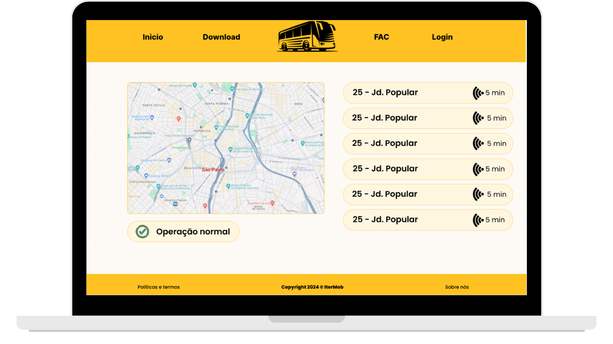
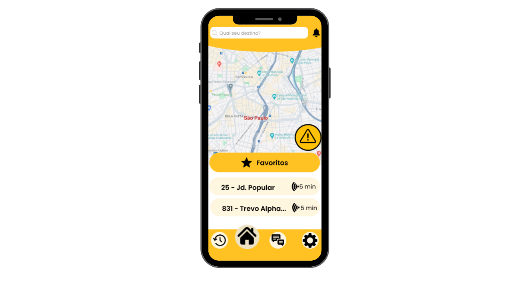
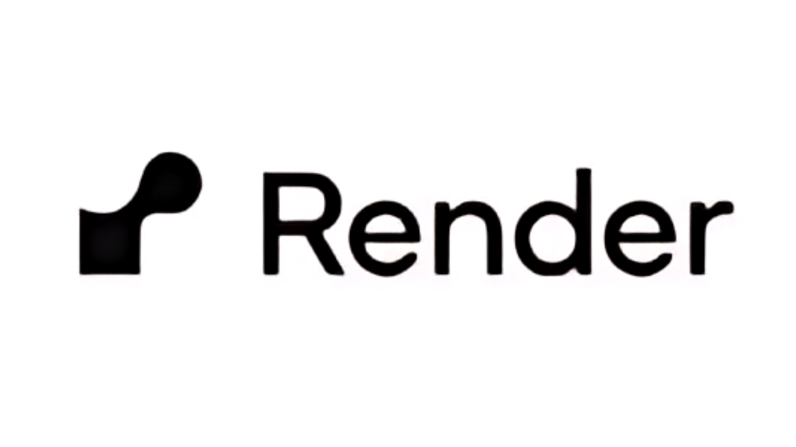
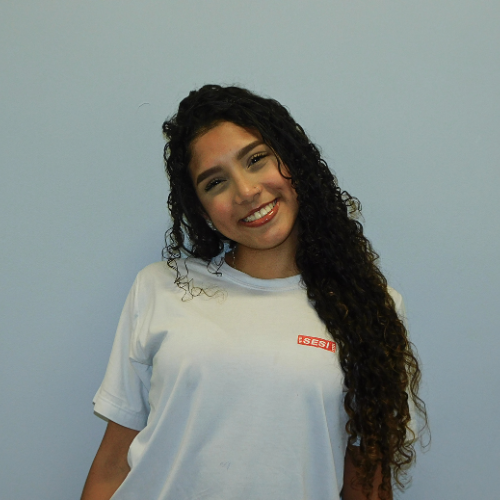
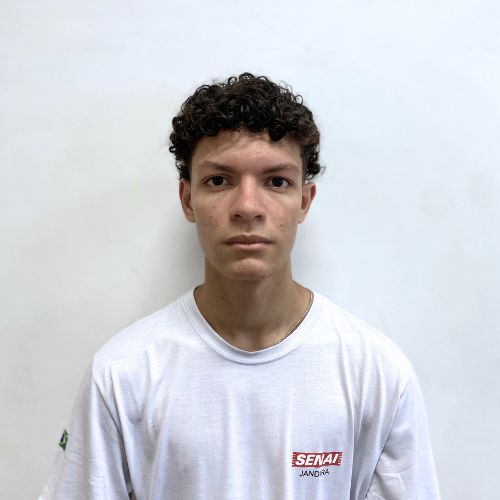

# 

### Tópicos
- [Descrição do projeto](#descrição-do-projeto)
- [Funcionalidades](#funcionalidades)
- [Como funciona?](#como-funciona)
- [Limitações:](#limitações)
- [Aplicação Desktop](#aplicação-desktop)
- [Aplicação Mobile](#aplicação-responsiva)
- [Ferramentas Utilizadas](#ferramentas-utilizadas)
- [Acesso ao projeto](#acesso-ao-projeto)
- [Desenvolvedores](#desenvolvedores)

## Descrição do projeto

 A <strong>Itermob</strong> nasceu com a missão de transformar a forma como as pessoas se deslocam nas cidades, oferecendo soluções tecnológicas inovadoras para facilitar a mobilidade urbana. A <strong>Itermob</strong> é uma plataforma inovadora de mobilidade urbana que visa transformar a experiência dos usuários no transporte coletivo. A proposta da aplicação é proporcionar uma solução integrada que permita aos usuários planejar, reservar e acompanhar suas viagens de forma eficiente e segura.

## Funcionalidades

<strong>Funcionalidade 1:</strong> Sistema de monitoramento em tempo real. 

<strong>Funcionalidade 2:</strong> Horários atualizados diariamente. 

<strong>Funcionalidade 3:</strong> Sistema para o cálculo de rotas. 

<strong>Funcionalidade 4:</strong> Notificações relacionadas a imprevistos na rota.

<strong>Funcionalidade 5:</strong> Interação com outros usuários. 

<strong>Funcionalidade 6:</strong> Melhora no acesso a informações dos prestadores de serviços.

<strong>Funcionalidade 7:</strong> Interface acessível.

<strong>Funcionalidade 8:</strong> Clareza nas informações. 

<strong>Funcionalidade 9:</strong> Histórico de viagens. 

## Como funciona?

## Limitações:

 Alguns recursos dependem de informações de terceiros (empresas que operam as linhas), de forma que a <strong> Itermob </strong>não poderá garantir o funcionamento 100% de todas as funcionalidades. 

## Aplicação Desktop

Acesse o repositório do front-end através do link: <a>https://github.com/nvpetri/Front-IterMob</a>

## Aplicação Mobile

Acesse o repositório mobile através do link: <a>https://github.com/nvpetri/itermob</a>

## Ferramentas Utilizadas

## Desenvolvedores

    
    <h3>Dev Mobile</h3>
    
Bianca Maria Soares

    

    
    <h3>Dev Front-END</h3>
    
Carolina Neponucena

    

    
    <h3>Dev Back-END</h3>
    
Igor Araujo

    

    
    <h3>Dev Full-Stack (SCRUM Master)</h3>
    
Nicolas Vasconcelos Petri

    

    
    <h3>Dev Front-END</h3>
    
Raica Martinez

    

